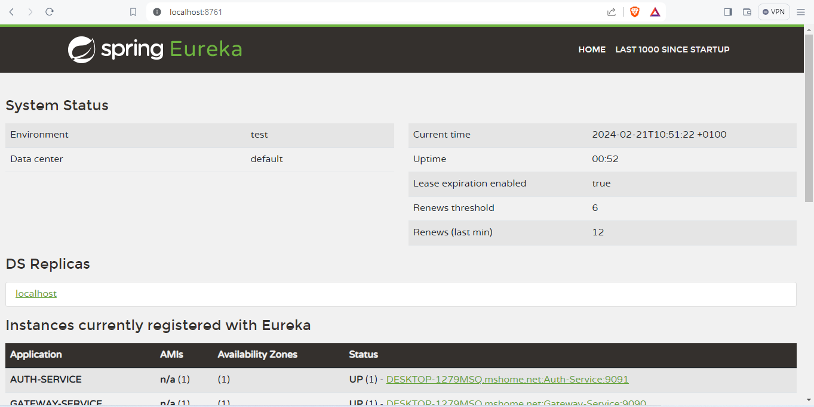
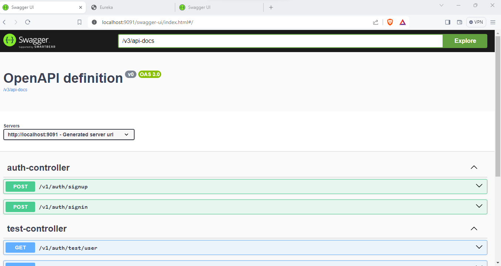

# Property Valuation Microservices

This repository contains a set of Spring Boot microservices for Property Valuation.

## Microservices Overview

1. **Server Service:** This is the eureka server all other services connects to for health check and for monitoring of the microservices.
2. **Gateway Service:** Responsible for routing requests to the appropriate microservice.
3. **Auth Service:** Handles authentication and authorization.
4. **Settings Service:** Manages application settings such as currency, categories, etc.
5. **Reports Service:** Generates and manages property valuation reports.
6. **FileUpload Service:** This manages file uploads to Amazon AWS S3 and downloads from Amazon AWS S3
7. **App Service:** Core service for property valuation system.
8. **Commons:** This module comprises classes shared among all microservices

## Prerequisites

- [Docker](https://www.docker.com/get-started)

## Running the Microservices

1. Clone the repository:

    ```bash
    https://github.com/joenan/property-valuation-micro-service.git
    ```

2. Navigate to the project directory:

    ```bash
    cd property-valuation-microservices
    ```

3. Pull Docker images using Docker Compose:

    ```bash
    docker-compose up -d
    ```

4. Build the Docker images for each service:

    ```bash
    docker build -t server-service . 
    docker build -t gateway-service .
    docker build -t auth-service . 
    docker build -t settings-service . 
    docker build -t reports-service . 
    docker build -t app-service . 
    docker build -t upload-service . 
    ```

5. Run the microservices using Docker:

    ```bash
    docker run -it -p 8761:8080 server-service
    docker run -it -p 9090:8080 gateway-service
    docker run -it -p 9091:8080 auth-service
    docker run -it -p 9093:8080 settings-service
    docker run -it -p 9092:8080 reports-service
    docker run -it -p 9094:8080 app-service
    docker run -it -p 9095:8080 upload-service
    ```

   These commands will pull the necessary Docker images, build the microservices, and run the containers.

6. Accessing the individual microservices:

   - Gateway: [http://localhost:9090](http://localhost:9090)
   - Auth Service: [http://localhost:9090/auth/**](http://localhost:9090/auth/**)
   - Settings Service: [http://localhost:9090/settings/**](http://localhost:9090/settings/**)
   - Reports Service: [http://localhost:9090/reports/**](http://localhost:9090/reports/**)
   - App Service: [http://localhost:9090/valuation/**](http://localhost:9090/valuation/**)
   - FileUpload Service: [http://localhost:9095/files/**](http://localhost:9095/files/**)
   - Server Service: [http://localhost:8761/](http://localhost:8761)


7. Signup an account:

```bash
   http://localhost:9090/security/v1/auth/signup
```

```
{
"username": "jonah",
"email": "jonah@gmail.com",
"name": "Jonah Gonzalez",
"businessUnit": "IT Department",
"contactNumber": "09033884495",
"password": "yourpassport"
}
```
Send the above payload to the url above to signup for a new account


6. SignIn and obtain auth token:

```
http://localhost:9090/security/v1/auth/signin
```

```
{
"username": "mcbuser",
"password": "P@ssword!$"
}
```

## Stopping the Microservices

To stop the running microservices, use the following command:

```bash
docker-compose down
```

7. The micro service has been deployed for testing and can be tested at:

```
   - Eureka Server: [http://63.250.53.24:8761](http://63.250.53.24:8761)
   - Gateway: [http://63.250.53.24:9090](http://63.250.53.24:9090)
   - Auth Service: [http://63.250.53.24:9090/auth/**](http://63.250.53.24:9090/auth/**)
   - Settings Service: [http://63.250.53.24:9090/settings/**](http://63.250.53.24:9090/settings/**)
   - Reports Service: [http://63.250.53.24:9090/reports/**](http://63.250.53.24:9090/reports/**)
   - App Service: [http://63.250.53.24:9090/valuation/**](http://63.250.53.24:9090/valuation/**)
   - FileUpload Service: [http://63.250.53.24:9095/files/**](http://63.250.53.24:9090/files/**)
```
8. The swagger config for every deployed service can be accessed through

   ```
   - Auth Service: [http://63.250.53.24:9091/swagger-ui/index.html](http://63.250.53.24:9091/swagger-ui/index.html)
   - Settings Service: [http://63.250.53.24:9093/swagger-ui/index.html](http://63.250.53.24:9093/swagger-ui/index.html)
   - Reports Service: [http://63.250.53.24:9092/swagger-ui/index.html](http://63.250.53.24:9092/swagger-ui/index.html)
   - App Service: [http://63.250.53.24:9094/swagger-ui/index.html](http://63.250.53.24:9094/swagger-ui/index.html)
   - FileUpload Service: [http://63.250.53.24:9095/swagger-ui/index.html](http://63.250.53.24:9095/swagger-ui/index.html)
```




